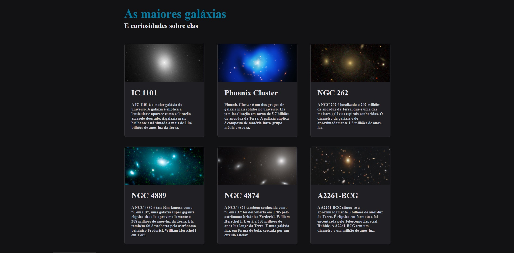

<h1 align="center"> Projeto das Galáxias ✨🖥️ </h1>

  

## 🚀 Tecnologias

Esse projeto foi desenvolvido com as seguintes tecnologias:

- HTML e CSS
- Git e Github
- Figma

## 💻 Projeto
 
Projeto criado com base nos conceitos de CSS Grid:
- Grid
- Grid-template

- [Acesse o projeto finalizado, online](https://jonatanfiuza.github.io/Galaxies)

